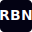

# Rain by Nurain (RBN) - E-commerce Platform



## 🌧️ About Rain by Nurain (RBN)

**Rain by Nurain (RBN)** is a bold, Gen Z streetwear e-commerce platform with a strict monochrome aesthetic. Our brand centers around the powerful tagline **"Left Home to Feed Home"** - representing ambition, sacrifice, and success.

### ✨ Brand Identity
- **Aesthetic**: Bold, minimalist, monochrome (black, white, grayscale)
- **Target**: Gen Z fashion enthusiasts
- **Typography**: Rubik font family throughout
- **Photography**: Editorial style with models
- **Design**: Clean, lots of whitespace, sharp typography

## 🚀 Features

### 🛍️ **Customer Experience**
- **Multi-currency support** (Naira ₦ and USD $)
- **Hero section** with single "Shop Now" button
- **New arrivals carousel** (max 8 products)
- **Email-based customer accounts** (no passwords required)
- **Real-time order tracking** and status updates
- **Comprehensive email notifications** (order confirmation, shipping updates)
- **Mobile-responsive design** with smooth micro-interactions

### 🏪 **E-commerce Functionality**
- **Product catalog** with categories and filtering
- **Shopping cart** with persistent storage
- **Secure checkout** with Paystack integration
- **Order management** with status tracking
- **Inventory management** through admin dashboard

### 🔧 **Admin Dashboard**
- **Product management** (add, edit, delete products)
- **Order management** (view, update status, add tracking)
- **Customer management** and order history
- **Email notifications** sent automatically on order updates
- **Real-time sync** between admin and customer accounts

### 📧 **Email System**
- **Resend integration** for reliable email delivery
- **Order confirmations** with RBN brand copy
- **Shipping notifications** with tracking information
- **Admin alerts** for new orders
- **Status update emails** when orders are updated

## 🛠️ Tech Stack

### **Frontend**
- **React 18** with TypeScript
- **Vite** for fast development and building
- **Tailwind CSS v4** for styling
- **React Router** for navigation
- **Motion (Framer Motion)** for animations
- **Lucide React** for icons

### **Backend**
- **Supabase** (database, auth, edge functions)
- **Hono** web server for API routes
- **Paystack** for payment processing
- **Resend** for email notifications

### **Deployment**
- **Netlify** for frontend hosting
- **Supabase Edge Functions** for backend API

## 🏃‍♀️ Quick Start

### Prerequisites
- Node.js 18+ 
- npm or yarn
- Supabase account
- Paystack account (for payments)
- Resend account (for emails)

### Installation
```bash
# Clone the repository
git clone https://github.com/yourusername/rain-by-nurain-ecommerce.git
cd rain-by-nurain-ecommerce

# Install dependencies
npm install

# Start development server
npm run dev
```

### Environment Variables
Create a `.env.local` file with:
```bash
VITE_SUPABASE_URL=your_supabase_url
VITE_SUPABASE_ANON_KEY=your_supabase_anon_key
VITE_PAYSTACK_PUBLIC_KEY=your_paystack_public_key
```

## 📦 Deployment

### Build for Production
```bash
npm run build
```

### Deploy to Netlify
1. Connect your GitHub repository to Netlify
2. Set build command: `npm run build`
3. Set publish directory: `dist`
4. Add environment variables in Netlify dashboard

## 🎨 Design System

### **Typography**
- **Font Family**: Rubik (300, 400, 500, 600)
- **Body Text**: 16px consistently across site
- **Prices**: Regular weight for minimalist look

### **Colors**
- **Primary**: #030213 (Black)
- **Background**: #ffffff (White)
- **Accents**: Grayscale variations
- **Strict Rule**: No colors outside monochrome palette

### **Layout**
- **Clean lines** with lots of whitespace
- **Editorial photography** with models
- **Sharp typography** for impact
- **Smooth micro-interactions** throughout

## 📱 Pages Structure

- **Homepage** - Hero, new arrivals, about, lifestyle sections
- **Shop** - Product catalog with filtering
- **Product Detail** - Individual product pages
- **Cart & Checkout** - Secure purchase flow
- **Account Dashboard** - Customer order history
- **About** - Brand story and mission
- **Community** - Brand engagement
- **Contact** - Customer support
- **Legal Pages** - Terms, privacy, returns, shipping

## 🔐 Security Features

- **XSS Protection** with security headers
- **CSRF Protection** on all forms
- **Secure payment processing** with Paystack
- **Email verification** for order confirmations
- **Admin authentication** for dashboard access

## 📊 Performance

- **Optimized build** with Vite
- **Code splitting** for faster loading
- **Image optimization** with WebP support
- **Caching strategies** for static assets
- **Mobile-first** responsive design

## 🤝 Contributing

1. Fork the repository
2. Create a feature branch
3. Make your changes
4. Test thoroughly
5. Submit a pull request

## 📞 Support

For support or questions about the RBN platform:
- **Email**: support@rainbynurain.com
- **Documentation**: Check the `/guidelines` folder
- **Issues**: Create a GitHub issue

## 📄 License

This project is licensed under the MIT License - see the LICENSE file for details.

---

**"Left Home to Feed Home"** - Rain by Nurain (RBN) © 2025